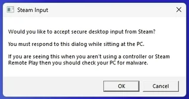

# 修复Steam Link连接问题

最近用Steam Link + iPad玩了波斯王子，感觉流畅性挺好的，几乎没有卡顿，也支持用手柄玩。就是每次重连的时候，会弹出一个框：



文字内容是：

```text
Steam Input

Would you like to accept secure desktop input from Steam?
You must respond to this dialog while sitting at the PC.If you are seeing this when you aren't using a controller or Steam Remote Play then you should check your PC for malware.
OK Cancel
```

大意是，需要点击一下才能继续使用Steam Link玩游戏。但是比较坑的地方在于，这个不能使用Steam Link远程点，必须使用被控的PC，用鼠标或者键盘相应才行。而我的笔记本合着盖子放在桌子下面，我并不想去打开后在关上。而且如果使用其他的电脑，远程到PC上，并不会展示这个弹窗。

介绍原因的时候需要先了解下原因。

Windows是支持被多个终端控制的，比如当前电脑（简称A），当然可以被连接到USB接口的键盘鼠标控制。如果其他的PC（简称B）安装的RDP（微软远程桌面软件）访问A，也可以控制B。这时候，就需要先退出A的终端，再登陆B的终端。但是，安装在iPad的Steam Link（简称C）是不支持直接退出A的终端的（可能是安全原因），需要这么点一下才行。

那么有没有什么方法，可以不直接操作A，使用Steam Link呢？当然是有的，只是需要借助另一台电脑B。

在B上使用管理员权限打开PowerShell并输入：

```shell
# 查询当前的session连接情况
query session
```


会显示如下的信息：

```text
PS C:\WINDOWS\system32> query session
 会话名               用户名                 ID  状态   类型        设备
 services                                            0  断开
>rdp-tcp#0                 mynzelo                   1  运行中
 console                                             3  已连接
 rdp-tcp                                         65536  侦听
```

可以看到，当前正在运行中的，当然是我通过B控制A的RDP软件，会话名是「rdp-tcp#0」，ID是1。而且，名为「console」的那个连接就是Steam Link的连接，它的状态是已连接，但是不是运行中。我们需要手动切换下session，执行如下命令：

```shell
# tscon SESSIONID /password:PWD /dest:console
tscon 1 /password:123456 /dest:console
```

这样，就可以将控制权转移给Steam Link了。

## 自动化

这种方式，还是需要另一台电脑来远程到Steam运行的电脑，多少有点不方便，如果使用流程自动化软件，将整个操作流程连接起来，大概是这样：

1. 在iPad上运行Steam Link
2. 使用Workflows触发通知Steam运行的PC（比如http请求、邮件都可以）
3. PC接收到请求后，执行powershell脚本切换session


## Note

1. 参考链接：https://johnlyu.com/2022/06/11/steam/